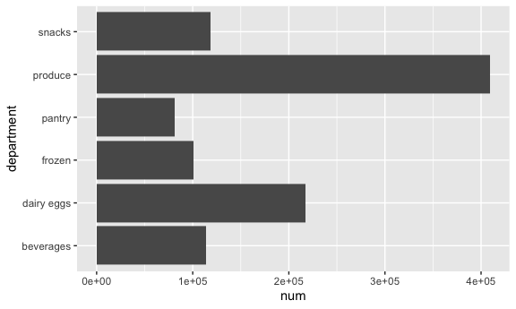
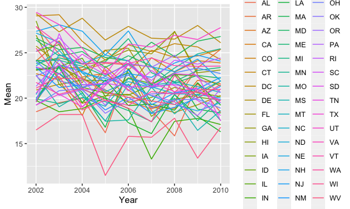

p8105\_hw3\_kw2961
================
Kaitlyn Wang
10/14/2021

``` r
library(tidyverse)
library(p8105.datasets)
library(lubridate)

knitr::opts_chunk$set(
  fig.width = 6,
  fig.asp = .6,
  out.width = "90%"
)
```

## Problem 1

The instacart dataset contains 1384617 rows and 15 columns. Each row
represents one single item with information about its id, name, aisle,
department and the user id of the people who order the item. Shown below
is a bargraph of the departments with more than 50000 items sold.

``` r
data("instacart")

total_num = 
  instacart %>% 
  group_by(department) %>% 
  summarise(num = n()) %>% 
  filter(num >= 50000)

ggplot(total_num, aes(x = department, y = num)) + geom_bar(stat = "identity") + coord_flip()
```



``` r
#How many aisles are there, and which aisles are the most items ordered from?
aisles = 
  instacart %>% 
  group_by(aisle) %>% 
  summarise(num = n()) %>% 
  arrange(desc(num))
```

There are 134 aisles and the fresh vegetables aisle is where the most
items are ordered from.

``` r
#Make a plot that shows the number of items ordered in each aisle, limiting this to aisles with more than 10000 items ordered. Arrange aisles sensibly, and organize your plot so others can read it.
aisles %>% 
  filter(num > 10000) %>%
  ggplot(aes(x = reorder(aisle, num), y = num)) + geom_bar(stat = "identity") + coord_flip() + labs(y = "Number or Items", x = "Aisles")
```


``` r
#Make a table showing the three most popular items in each of the aisles “baking ingredients”, “dog food care”, and “packaged vegetables fruits”. Include the number of times each item is ordered in your table.
most_pop = 
  instacart %>% 
    select(product_name, aisle) %>% 
    filter(aisle == "baking ingredients" | 
           aisle == "dog food care" | 
           aisle == "packaged vegetables fruits") %>% 
    group_by(aisle, product_name) %>% 
    summarise(num = n()) %>% 
    arrange(desc(num), .by_group = TRUE) %>% 
    group_by(aisle) %>% 
    slice(1:3)
```

The top three items in the baking ingredients aisle are Light Brown
Sugar, Pure Baking Soda and Cane Sugar. The top three items in the dog
food care aisle are Snack Sticks Chicken & Rice Recipe Dog Treats,
Organix Chicken & Brown Rice Recipe and Small Dog Biscuits. The top
three items in the packaged vegetables fruits aisle are Organic Baby
Spinach, Organic Raspberries and Organic Blueberries.

``` r
#Make a table showing the mean hour of the day at which Pink Lady Apples and Coffee Ice Cream are ordered on each day of the week; format this table for human readers (i.e. produce a 2 x 7 table).
mean_hour = 
  instacart %>% 
  select(product_name, order_dow, order_hour_of_day) %>% 
  filter(
    product_name == "Pink Lady Apples" |
    product_name == "Coffee Ice Cream"
  ) %>% 
  group_by(product_name, order_dow) %>% 
  summarise(mean = round(sum(order_hour_of_day)/n(), digits = 0)) %>% 
  rename(week = order_dow) %>% 
  mutate(week = week + 1) %>%
  mutate(week = wday(week, label = TRUE)) %>% 
  pivot_wider(
    names_from = "week",
    values_from = mean
  )
```

## Problem 2

``` r
data("brfss_smart2010")
```

``` r
BRFSS = 
  brfss_smart2010 %>% 
  janitor::clean_names() %>% 
  rename(state = locationabbr, county = locationdesc) %>% 
  filter(topic == "Overall Health") %>% 
  mutate(response = factor(response, levels = c("Poor", "Fair", "Good", "Very good", "Excellent")))
```

``` r
#In 2002, which states were observed at 7 or more locations? What about in 2010?
svn_loc_2002 = 
  BRFSS %>% 
  filter(year == 2002) %>% 
  select(state, county) %>% 
  distinct() %>% 
  group_by(state) %>% 
  summarise(n = n()) %>% 
  filter(n >= 7) %>% 
  arrange(n)

svn_loc_2010 = 
  BRFSS %>% 
  filter(year == 2010) %>% 
  select(state, county) %>% 
  distinct() %>% 
  group_by(state) %>% 
  summarise(n = n()) %>% 
  filter(n >= 7) %>% 
  arrange(n)
```

In 2002, there were 6 states that were observed at 7 or more locations
whereas 14 states were observed at 7 or more locations in 2010. See
tables for specific states in each year.

``` r
#Construct a dataset that is limited to Excellent responses, and contains, year, state, and a variable that averages the data_value across locations within a state.Make a “spaghetti” plot of this average value over time within a state.
excellent = 
  BRFSS %>% 
  filter(response == "Excellent") %>% 
  select(year, state, county, response, data_value) %>% 
  group_by(year, state) %>% 
  summarise(mean = round(sum(data_value)/n(), digits = 2))
  
ggplot(excellent, aes(x = year, y = mean, color = state)) + geom_line() + labs(
  x = "Year",
  y = "Mean"
)
```



``` r
#Make a two-panel plot showing, for the years 2006, and 2010, distribution of data_value for responses (“Poor” to “Excellent”) among locations in NY State.
ny = 
  BRFSS %>% 
  filter(
    state == "NY", 
    year == 2006 | 
    year == 2010,
    na.rm = TRUE) %>% 
  select(year, county, data_value, response)

ggplot(ny, aes(x = response, y = data_value, color = county)) + 
  geom_point() + 
  facet_grid(. ~ year)
```


## Prblem 3

``` r
accel = 
  read_csv("./data/accel_data.csv") %>% 
  janitor::clean_names() %>% 
  mutate(
    day_type = ifelse((day == "Saturday" | day == "Sunday"), "weekend", "weekday")
    ) %>% 
  relocate(day_type, .after = day) %>% 
  mutate(day = factor(day, levels = c("Sunday", "Monday", "Tuesday", "Wednesday", "Thursday", "Friday", "Saturday")))
```

The dataset includes 5 weeks/35 days of observations. The activity\_\*
columns represent the data collected in each minute of the day. There
are data being recorded each day. The week, day and day types of the
data being collected are also shown in the table.

``` r
total = 
  accel %>% 
  group_by(week, day, day_type) %>% 
  summarise(num = sum(across(activity_1:activity_1440))) %>% 
  pivot_wider(
    names_from = "week",
    values_from = num
  ) %>% 
  rename(week_1 = '1', week_2 = '2', week_3 = '3', week_4 = '4', week_5 = '5') 
```

There does not seem to have a trend.

``` r
plot =   
  accel %>% 
  pivot_longer(
    activity_1:activity_1440,
    names_to = "min",
    values_to = "activity"
  ) %>% 
  mutate(
    min = as.numeric(substr(min, start = 10, stop = nchar(min))
  ))
  
ggplot(plot, aes(x = min , y = activity, color = day)) + 
  geom_line() +
  scale_x_continuous(
    breaks = c(0, 360, 720, 1080, 1440),
    labels = c("00:00", "06:00", "12:00", "18:00", "23:59")
  ) +
  labs(
    title = "24-hour Activity Time Courses",
    x = "Time",
    y = "Level of Activity"
  )
```


The graph shows that the subject has the lowest level of activity during
midnight to 6 am. This is probably due to lower physical activity during
sleeping hours.
